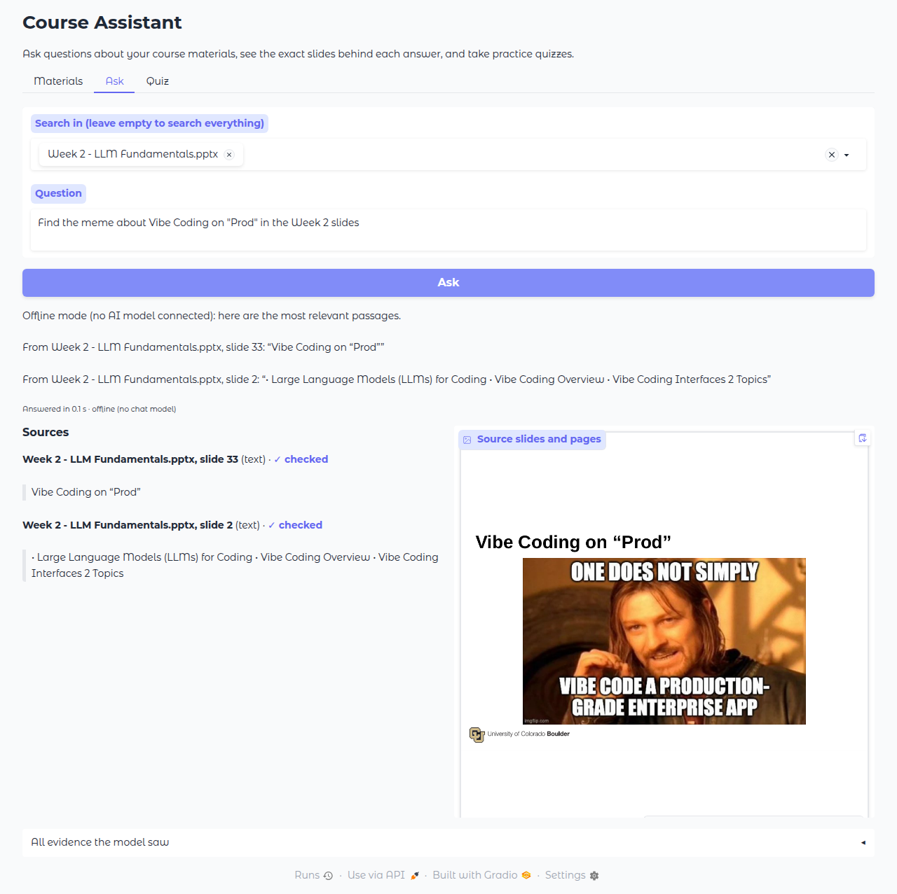
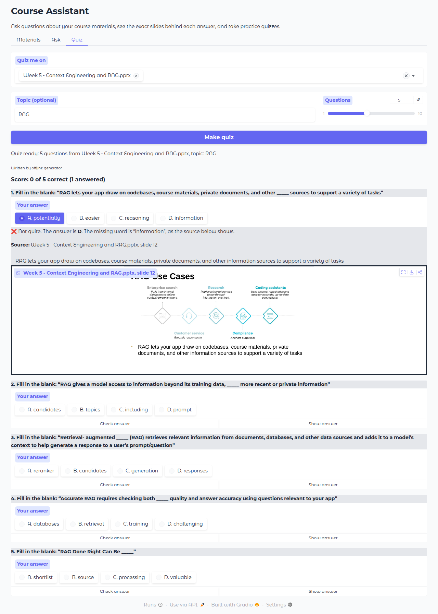
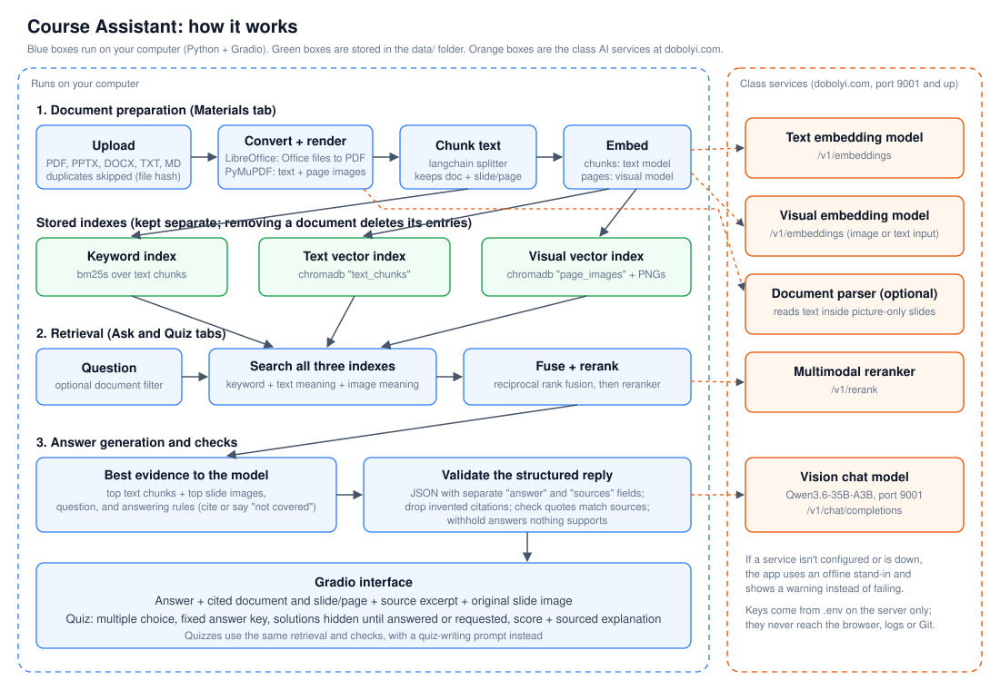

# Course Assistant (MBAX 6418, Assignment 2)

A Python app that answers questions about the course materials and makes practice quizzes. It searches the slides by keyword, by meaning, and by what the slide images look like (hybrid RAG). It shows the actual slide behind every answer, and it says so when the materials don't cover a question.

> **Status: first full version, not yet tested against the class AI services.**
> The app was built and tested in a workspace that can't reach dobolyi.com. Everything below that says "offline" ran with built-in stand-ins instead of the class models. The team still needs to connect the class services, rerun the evaluation, and replace the screenshots and results. See [What was tested and what wasn't](#what-was-tested-and-what-wasnt).

Other project docs: [PLAN.md](PLAN.md) (build plan and issues), [docs/assignment-summary.md](docs/assignment-summary.md), [docs/decisions.md](docs/decisions.md), [docs/course-materials.md](docs/course-materials.md).

## Screenshots

**An answer with its supporting slide image** (offline mode, searching Week 2 for the "Vibe Coding on 'Prod'" meme). The sources list the deck and slide number, each quote is checked against the source, and the original slide image is shown:



**Quiz feedback with sources** (offline mode). The answer stays hidden until you check your answer or ask to see it. Feedback shows the correct option, the source and the original slide:



Dark mode ([screenshot](docs/images/answer-dark-mode.png)) and the Materials tab ([screenshot](docs/images/materials.png)) were also checked.

## Setup

### 1. Install the software

You need:
- **Python 3.11 or newer**: [python.org/downloads](https://www.python.org/downloads/)
- **LibreOffice** (free), to read PowerPoint and Word files: [libreoffice.org/download](https://www.libreoffice.org/download/)
  - On a Mac, LibreOffice installs `soffice` at `/Applications/LibreOffice.app/Contents/MacOS/soffice`. Put that path in `SOFFICE_PATH` in your `.env` (step 3).
  - On Windows it's usually `C:\Program Files\LibreOffice\program\soffice.exe`.
  - Without LibreOffice, PDF, TXT and Markdown still work. Export decks to PDF in PowerPoint and upload the PDF instead.

### 2. Get the code and install the Python packages

```bash
git clone https://github.com/burnt-ham/assignment-2.git
cd assignment-2
python3 -m venv .venv
source .venv/bin/activate          # Windows: .venv\Scripts\activate
pip install -r requirements.txt
```

### 3. Connect the class services

```bash
cp .env.example .env               # Windows: copy .env.example .env
```

Open `.env` in a text editor and fill in the class key, plus the address and model name of each class service. The file has a comment for each line.

- `.env` is ignored by git, so your key stays on your computer. **Never put a real key in `.env.example`, the README, screenshots or anything else that gets committed.**
- Any service you leave blank uses an offline stand-in, so the app always starts. The Materials tab shows which services are in use under **AI services in use**.
- The chat model's address and name come from the Week 4 slides. The embedding, reranking and document-parsing services are on ports 9001 and up; get their ports and model names from the class.

### 4. Start the app

```bash
python app.py
```

Open http://127.0.0.1:7860 in your browser. To stop it, press Ctrl+C in the terminal.

## Using the app

**Study Spaces:** use the selector above the tabs to create, switch, rename or delete a study context (for example, MBAX 6418 and Finance Final). Each space has its own document library, rendered slide images, keyword index and text/visual vector indexes. Uploading the same file to two different spaces is allowed; duplicates are checked within one space. Switching spaces clears the current answers and quiz from the page, and Ask and Quiz use only the active space's documents. To delete a space, switch to a different one and select the inactive space in the deletion control. Deletion permanently removes its stored documents and indexes; the last space cannot be deleted. This is a single-user, app-wide selector, **not** separate accounts, access control, or a security boundary. Avoid running multiple users in the same app process, since changing the active space changes it for everyone.

**Existing installations:** on first launch, the old `data/library.json`, `data/docs/` and `data/chroma/` are copied into a fresh default **My Study Space**, including updated slide-image paths. The originals are kept in place as a recovery copy; do not delete them until you have checked the migrated library and backups yourself. Stop the old app before upgrading so its index files are not being written during copying. If `data/profiles/default/` exists but `data/profiles.json` does not (for example, after an interrupted migration), startup stops without overwriting either copy. Inspect and back up both locations before removing or repairing the incomplete destination; do not remove the legacy originals as a workaround. Later uploads stay in the active space and do not reset other spaces. The registry is `data/profiles.json`; each space's files live under `data/profiles/{space-id}/`. Future quiz history can live in the same folder.

**Materials tab:** choose one or more files and click **Add to library**. Large decks take a while; the 42-slide Week 2 deck took about 70 seconds to convert. Uploading a file that's already there does nothing, even under a different file name. To remove a document, pick it in **Remove a document** and click **Remove**. Its text, slide images and search entries are all deleted, so later answers can't use it.

**Ask tab:** type a question and click **Ask**. You can limit the search to certain documents. The answer shows:
- the sources, each with its document and slide or page, the quote it relies on, and whether that quote was found in the source (**✓ checked**)
- the original slide or page images
- under **All evidence the model saw**, everything the search found, with scores

If nothing in the materials supports an answer, the app says so instead of guessing.

**Quiz tab:** pick documents, optionally type a topic, choose how many questions, and click **Make quiz**. For each question, pick an answer and click **Check answer**, or click **Show answer** to see it without scoring. The score counts only checked answers. The answer key is fixed when the quiz is made, and the explanation shows the source excerpt and slide.

### Quiz 2.0 creation work (in progress)

Model-written questions now carry a reusable **concept** and a specific **learning target**, shown beside each question; the quiz header summarizes concept coverage. A topic filters retrieval, while an unfocused quiz draws evidence across selected documents and across each long document. Creation checks source IDs and text quotes, four nonblank choices distinct after case/whitespace normalization, course-section labels masquerading as concepts, and generic all/none options. Choices are displayed as written, so scientific names and programming syntax are not silently changed; near-duplicates with different punctuation or wording still need human review. Rejected or repeated questions trigger up to two bounded replacement batches rather than silently shrinking the quiz. If a replacement call fails, previously accepted questions remain; service error details are not shown to students. Offline fallback questions are simpler term-recall questions, explicitly labeled with source-derived tags.

**Quality limit:** these deterministic checks do not prove that a paraphrased explanation is entailed by the source, that distractors are equally plausible, or that exactly one choice is semantically correct. The team must review real model output against its cited evidence before relying on it. Persistent question banks, attempts, study statuses, adaptive review and Study Space-scoped history are later Quiz 2.0 work, not part of this creation slice.

### Supported files

| Type | How it's read |
|---|---|
| PDF (.pdf) | Text from each page, plus an image of each page |
| PowerPoint (.pptx, .ppt) | Converted to PDF with LibreOffice, then read like a PDF, one image per slide |
| Word (.docx, .doc) | Converted to PDF with LibreOffice, then read like a PDF |
| Text (.txt), Markdown (.md) | Split into sections at Markdown headings; no images |

Speaker notes in PowerPoint files are not read. Repeated headers and footers (like "Syllabus (Subject to Change) 3") are removed from page text so they don't clutter search results. All five course decks in `materials/` were converted and checked by eye, including Week 2 slide 33 (the meme), which matches the original.

## How it works



| Step | What happens | Code | Runs on |
|---|---|---|---|
| Document preparation | Upload, skip duplicates (file fingerprint), convert Office files with LibreOffice, extract text and render page images with PyMuPDF, split text into chunks that keep the document and slide number | `course_assistant/ingest.py`, `library.py` | Your computer |
| Indexes | Keyword index (bm25s), text vector index and a separate image vector index (chromadb), all saved in `data/` | `library.py` | Your computer |
| Embeddings | Text chunks go to the text embedding model; page images go to the visual embedding model | `services.py` | Class services |
| Retrieval | Search all three indexes, combine the results with reciprocal rank fusion, then rerank with the multimodal reranker | `retrieval.py` | Your computer + class reranker |
| Answer generation | Send the best text chunks and slide images to the vision chat model with answering rules; it must reply in JSON with separate `answer` and `sources` fields | `answering.py` | Class chat model |
| Checks | Validate the JSON (with one retry), drop citations to evidence that wasn't supplied, check each quote appears in its source, and withhold answers nothing supports | `answering.py` | Your computer |
| Quizzes | Same retrieval, a quiz-writing prompt, then checks for 4 distinct options, one valid correct answer, and a real supporting quote | `quiz.py` | Your computer + class chat model |
| Interface | Gradio app with Materials, Ask and Quiz tabs | `app.py` | Your computer |

**Offline stand-ins** (`services.py`) take over when a service isn't configured or doesn't respond: word-count vectors instead of text embeddings, page text instead of real image embeddings, word overlap instead of the reranker, and quoted passages instead of written answers. Quizzes fall back to fill-in-the-blank questions. The app shows a warning when this happens.

**Keys:** read only from `.env` or environment variables on the computer running the app. They are sent only to the class services, and are removed from any error message before it is shown or logged (`config.py: redact`).

## Tests

```bash
python -m pytest
```

The automated suite needs no internet or class services. It uses fake AI services that return scripted replies. On Windows with Python 3.12 and no LibreOffice, 114 tests passed and two were skipped (PowerPoint conversion and a directory-symlink check requiring Windows privileges). After changing index-deletion order and closing test clients at teardown, more than 40 consecutive integrated runs passed without the earlier Chroma 1.5.9 HNSW reader error. This is an empirical mitigation, not proof of an upstream fix; continue monitoring.

- **Unit tests** (`tests/test_ingest.py`, `test_library.py`, `test_retrieval.py`, `test_answering.py`, `test_quiz.py`, `test_config.py`) check individual parts: reading PDF, Markdown and PowerPoint files, chunking with source details, duplicate detection, removal, rank fusion, JSON parsing, quote checks, dropping invented citations, quiz validation, scoring, the fixed answer key, and that keys never appear in error messages.
- **End-to-end tests** (`tests/test_end_to_end.py`) run complete workflows: add files, repeat an upload, ask text and image questions, make and score a quiz, remove a document and confirm answers no longer use it, questions the materials can't answer, and the chat model and reranker both being down.
- **Study Space tests** (`tests/test_study_spaces.py`) check isolated uploads/search across spaces, migration with page images, UI controls, deletion, renaming and restart persistence.

The PowerPoint test is skipped automatically if LibreOffice isn't installed.

## Evaluation

The question set is in [eval/questions.json](eval/questions.json): five text questions (syllabus and slides), two visual questions (the Week 2 meme and the Week 5 hybrid RAG diagram), and one question the materials can't answer.

| ID | Question | Type | Expected source |
|---|---|---|---|
| Q1 | When are the professor's office hours? | text | Syllabus p.1 |
| Q2 | How much of the final grade is the final project worth? | text | Syllabus p.2 |
| Q3 | What is the penalty for turning in an assignment late? | text | Syllabus p.2-3 |
| Q4 | What is KV caching, and what is its tradeoff? | text | Week 2 slide 11 |
| Q5 | In a hybrid RAG pipeline, what does reranking do? | text | Week 5 slide 18 |
| Q6 | Find the meme about Vibe Coding on "Prod" in the Week 2 slides. What do its image and text show? | visual | Week 2 slide 33 |
| Q7 | Describe the diagram of the hybrid RAG pipeline with reranking from the Week 5 slides. | visual | Week 5 slide 18 |
| Q8 | How much does a parking permit for the Koelbel building cost? | not answerable | none |

**Design comparison:** hybrid search (keyword + text + image) vs. embeddings only (text + image, no keyword search), on the same questions and files. To run it, start the app once, add all five decks and the syllabus PDF, stop it, then run:

```bash
python scripts/evaluate.py                    # hybrid vs. embeddings only
python scripts/evaluate.py --compare rerank   # optional: reranking on vs. off
```

Results are saved in `eval/results/` as JSON, CSV and a Markdown table. The script checks each answer automatically: the expected source was cited, the answer contains an expected keyword, and an unanswerable question was declined. It also records the time taken. Then read every answer and fill in the **Correct (team check)** column yourselves, because the automatic check is only a first pass.

### Results so far (offline stand-ins only)

[eval/results/offline-standin-retrieval.md](eval/results/offline-standin-retrieval.md) is a dry run with no class services connected. It shows the pipeline works end to end, but it is **not** a real comparison: with stand-ins, both settings scored 6/8 on the automatic check, with the expected source cited for 7/8. Both settings missed the meme question (Q6), as expected, because the stand-in can't see images.

**To do (team):** rerun with the class services connected, replace this section with the real table, and write the interpretation: which approach you'd keep and why, using correctness, source support and time.

## Limitations and an investigated failure

**Investigated: the meme question without a document filter (offline).** Asking "Find the meme about Vibe Coding on 'Prod' in the Week 2 slides" across all documents returned syllabus page 7 first and the meme slide second. The syllabus schedule mentions "Week 2", "Vibe Coding" and other query words, so word-overlap scoring ranked it higher. The meme slide itself has only its title as text. Limiting the search to the Week 2 deck put slide 33 first (see the screenshot). With the class visual embedding model and reranker, the image itself should be matched, so the team should rerun this to confirm.

Other limitations:
- **Class service formats are unconfirmed.** The text embedding, visual embedding, reranker and parser clients follow the usual vLLM formats (`/v1/embeddings`, `/v1/rerank`, `/v1/chat/completions`). They were not tested against the real class services. If a service replies with an error, the message appears in the app and the stand-in takes over for that question.
- **Source checking is by quote only.** The app confirms each quoted phrase appears in its source. It doesn't check that the source fully supports every sentence of the answer. For image evidence it can't check automatically, so the slide is shown for you to compare.
- **Picture-only slides:** without the document parser service, a slide whose only text is in an image can be found only through image search.
- **Speed:** converting large decks takes time (Week 2: about 70 s; Week 6, which has embedded videos, about 28 s). Videos and animations aren't captured, only a still image of each slide.
- **One user at a time:** the library is shared by everyone using the same running app.

## What was tested and what wasn't

| Tested | How |
|---|---|
| 114 automated tests pass, 2 environment-dependent tests skipped | `python -m pytest`, Python 3.12, Windows, no LibreOffice or symlink privilege |
| All five course decks and the syllabus convert and load | Loaded in the app; slide images compared with the originals by eye |
| Add, repeat upload, remove, ask, quiz, check and show answer | Clicked through in a browser (Chromium) in offline mode |
| Theme controls function in offline browser QA | Full light/dark visual sign-off of Study Spaces and Quiz 2.0 is still pending |
| Keys stay out of errors | Unit test with a fake service that echoes the key back |
| Evaluation script runs | Offline dry run, saved in `eval/results/` |

| Not tested yet | Why |
|---|---|
| Any class service (answers, embeddings, reranking, parsing) | This workspace can't reach dobolyi.com |
| Answer and quiz quality with the real chat model | Same |
| The real design comparison | Same; needs the class services |
| Fresh-clone setup on Mac and Windows with LibreOffice | Study Spaces and automated tests were exercised on Windows without LibreOffice; a teammate should follow this README on a fresh clone with LibreOffice and fix any missing steps |

## Working on this as a team

- **Branch:** your own copy of the code to work on without affecting anyone else. Create one from `main` for each task, e.g. `git checkout -b fix-quiz-scores`.
- **Commit:** a saved checkpoint of your changes with a short message.
- **Pull request (PR):** a request to merge your branch into `main`. A teammate reviews it on GitHub before it's merged.
- **Issue:** a task on GitHub. The plan's steps are issues #2 to #12; assign yourself to the ones you pick up.
